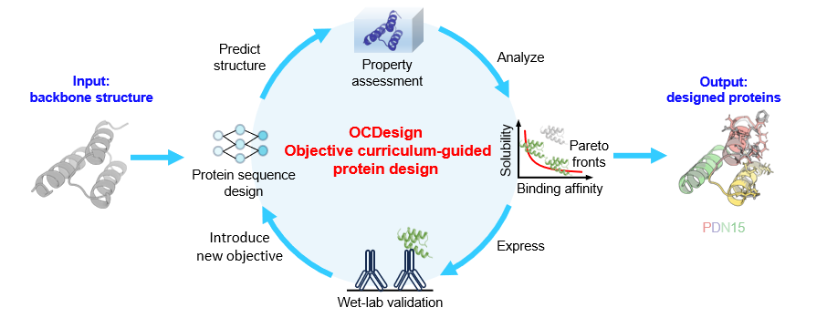

# OCDesign

OCDesign works as following steps:
Step 1: Design protein sequences (NeuralMRF, ProDESIGN-LE, or other methods you like)
Step 2: Assess your proteins for the properties (Solubility, Energy, or all other properties you need)
Step 3: Select pareto fronts for the next wet-lab validation
Step 4: Feedback From the wet-lab to correct your Step1-3

## NeuralMRF: Design protein sequence for a given protein structure
* Input: Protein structure (.pdb file)
* Output：A .fasta file with designed protein sequence

### Environment
* We need to use "conda" command, so we need to setup anaconda 4.10.1 first
* All the setup information needed is stored in "environment_droplet.yml" file in target folder (NeuralMRF)
* To setup environment, locate the target folder, use command "conda env create -f environment.yaml"

### Parameter
* --seed: A random seed, which can influence the sequence we design and some variables like "identity", the input type is int, default to 0, which means choose an integer randomly from 0 to 999 as the seed. Please do NOT input negative seed
* --checkedpoint_path: An address point to the model file, the input type is string, default to point to the "model_110.pth" file in "NeuralMRF" folder 
* --device: GPU choice, the input type is string, default to "1", which means the device is "cuda:1"
* --chain: Assigned chain, the input type is string, default to "C", which means to choose C-chain. If an assigned chain is needed, please assign a SINGLE chain
* --fix_native_pos: the sequence position of assigned amino acids, the input type is int, default to none
* --fix_native_val: the type of assigned amino acids, the input type is string, which means the single letter abbreviation of the amino acid, default to none. If an assigned amino acid is needed, plese match the "fix_native_pos" and "fix_native_val" one by one.
* --pdb_path: The location of .pdb file we want to handle, the input type is string, default to the "5U4Y_C.pdb" file in "MPNN_dataset" folder

### Brief description
* The program read the name, sequence, the 3D coordinates of CA, C, A, O atoms of the given chain of the protein in assigned .pdb file firstly, then store what we get to the "test.jsonl" file in current folder
* Then, create tensors based on the information, and generate samples according to the random seed. After process, we design the protein sequence and store in the .jsonl file with correspond name in the subfolder "generated_fasta"

### Execute example
* Input command "python test_PL.py --seed 37 --chain "A" --fix_native_pos 0 3 --fix_native_val "A" "C" --pdb_path "1acf.pdb"" in the terminal
* It means to choose 37 as the random seed, assign A-chain with the zero and third digit are replaced to "A" and "C" to handle "1acf.pdb"
* Result we get：
>\>1ACF_A Identity:0.416
SWEDIVDEEFVGQGKVDKAALLSLDGTVLASSEGFTVTKEEGVKLAKAFEDPSEVKKNGFELDGVHYKVEEATDEEIIGKNGDEGVVCRKLPNCILVGYYTANQDKEEAKKVVKELAKKLEEKGW

## Pareto front selecetion
>python pareto_frontier.py CSVFILE 'Property1:[min|max],Property2:[min:max]'
python  pareto_frontier.py  example/pareto/r2_pareto.csv --sort 'RMSD_VAR:min,MMGBS:min,Solubility:max'
